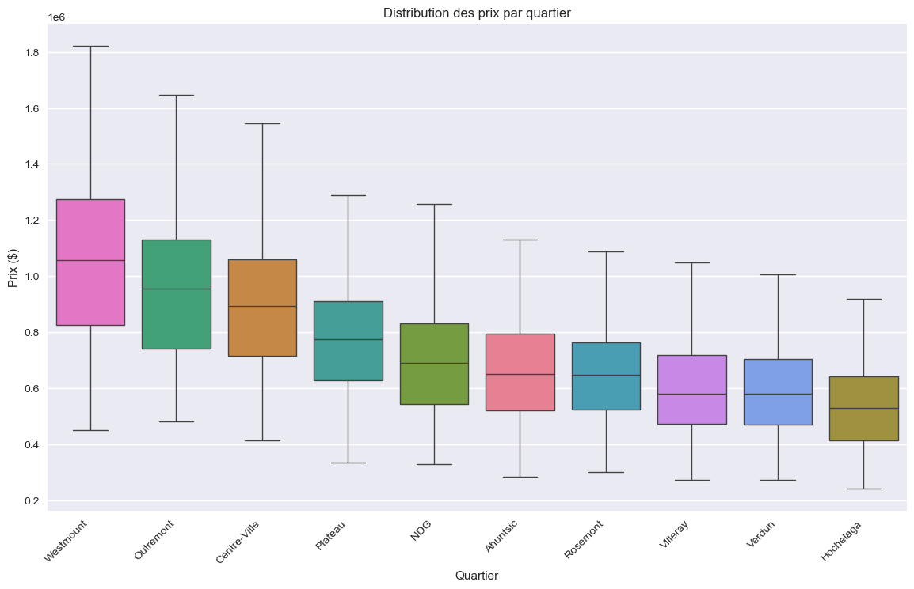
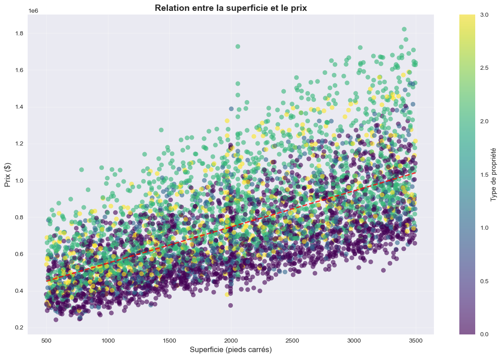
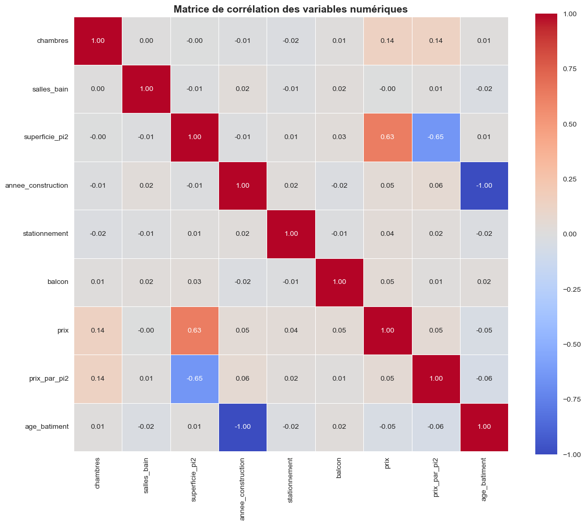
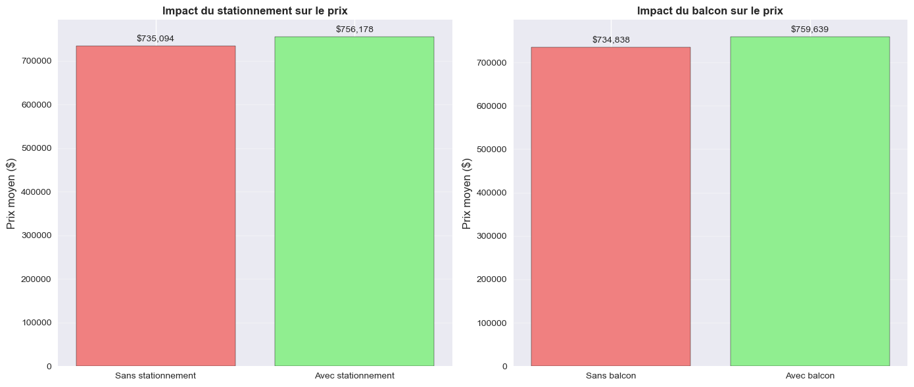
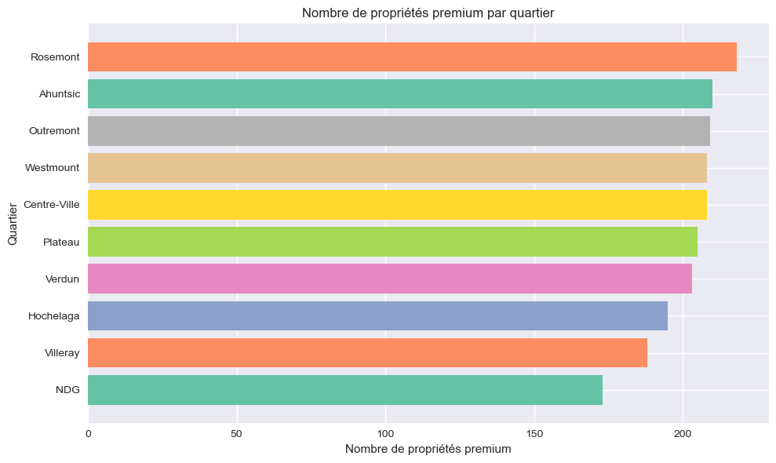

# Montreal Real Estate — Exploratory Data Analysis

**What drives property prices in Montreal, and where do buyers get the most space for their money?**

An exploratory analysis of **5,000 properties across 10 Montreal neighbourhoods**, built in Python with pandas, seaborn and matplotlib.

`Python` · `pandas` · `NumPy` · `seaborn` · `matplotlib` · `Jupyter`



---

## Key findings

| | Finding |
|---|---|
| 📐 | **Size is the main price driver.** Floor area is by far the variable most correlated with price (r ≈ 0.63). Bathrooms, balcony and construction year show almost no linear relationship with price. |
| 📍 | **Location splits the city into separate markets.** Westmount's median price is above $1M, about double Hochelaga's (≈ $526K). Westmount alone holds 56% of the "very high-end" properties; Hochelaga has none. |
| 💰 | **Best value per square foot: Hochelaga.** ≈ $307/sq ft versus ≈ $603/sq ft in Westmount — nearly twice the space for the same budget. |
| 🚗 | **Amenities add value, but modestly.** Parking adds about **$21K** to the average price and a balcony about **$25K** (≈ 3–4% of an average property). |
| 🏢 | **Condos dominate the supply** (40% of listings), yet houses concentrate the most total value. |

## Analysis highlights

<table>
<tr>
<td width="50%"><br><sub>Price rises steadily with floor area.</sub></td>
<td width="50%"><br><sub>Floor area is the only strong correlate of price.</sub></td>
</tr>
<tr>
<td width="50%"><br><sub>Parking and balcony: a real but small premium.</sub></td>
<td width="50%"><br><sub>High-end properties are concentrated in a few neighbourhoods.</sub></td>
</tr>
</table>

All 14 charts are in [`images/`](images/). Chart labels are in French, as the project was delivered in French.

## Approach

1. **Data quality check.** 100 missing floor-area values and 150 missing construction years were identified and handled; types were checked and derived columns created (price per sq ft, building age, price category).
2. **Exploratory analysis.** Grouped statistics by neighbourhood and property type (`groupby`, `agg`, `pivot_table`), correlation matrix, distributions (`value_counts`), group comparisons and contingency tables (`pd.crosstab`).
3. **Visualization.** 14 charts: histograms, box plots, scatter plots, bar charts, a correlation heatmap, a violin plot and pie charts.
4. **Research questions.** Three questions answered with evidence: key price drivers, price by neighbourhood and value per sq ft, and the effect of building age.

## Repository structure

```
├── data/housing_dataset.csv                   # 5,000 properties, 10 columns
├── notebook/montreal_real_estate_eda.ipynb    # full analysis (French)
└── images/                                    # the 14 exported charts
```

**Run it:** `pip install pandas numpy seaborn matplotlib jupyter`, then open the notebook.

## Team and my role

Team project for **DECI1022 – Data Analysis with Python**, Data Analytics program, CCNB Bathurst (Winter 2026).
Team: **Sanaba Kanté**, Abir Abid, Mustapha Boubkiri.

**My contribution:** Section 4 — Exploratory analysis (grouped statistics, correlation analysis, distributions, group comparisons, contingency tables) and Section 5 — **all 14 visualizations**. I also presented these sections in the team pitch.

> The dataset was provided for the course and is used for learning purposes; it may not reflect actual Montreal market prices.

---

<details>
<summary><b>🇫🇷 Résumé en français</b></summary>

Analyse exploratoire de **5 000 propriétés dans 10 quartiers de Montréal** (Python, pandas, seaborn).

- La **superficie** est le principal moteur du prix (corrélation ≈ 0,63).
- Le **quartier** crée des marchés séparés : médiane de plus d'un million à Westmount, contre ≈ 526 000 $ à Hochelaga.
- **Meilleur rapport qualité-prix :** Hochelaga, à ≈ 307 $/pi², contre ≈ 603 $/pi² à Westmount.
- Un **stationnement** ajoute ≈ 21 000 $ et un **balcon** ≈ 25 000 $ au prix moyen.

Projet d'équipe (DECI1022, CCNB Bathurst, hiver 2026). **Ma contribution :** l'analyse exploratoire (section 4) et les 14 visualisations (section 5).
</details>
